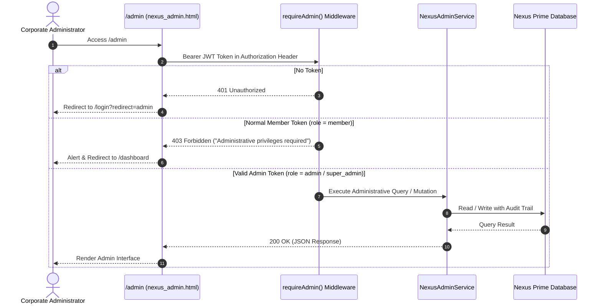

# NEXUS PRIME (PVT) LTD — ADMIN COMMAND CENTER ARCHITECTURE & SPECIFICATION
**Domain:** `nexusp.online`  
**System Layer:** Administrative Frontend, API Endpoints & Enterprise Business Logic  
**Version:** 1.0.0-PROD  
**Status:** Live, Fully Implemented & Test-Verified (41/41 Tests Passing)  

---

## 1. Executive Summary & Safety Invariants

The **Nexus Prime Admin Command Center** (`/admin` & `nexus_admin.html`) serves as the central operational headquarters for authorized corporate administrators of Nexus Prime (PVT) Ltd (`nexusp.online`).

### Core Safety Invariants:
1. **100% Hapanamy.lk Isolation**: Complete separation from `hapanamy.lk`. Zero shared tables, records, sessions, API credentials, or storage objects. All administrative data structures reside solely within the isolated Nexus Prime runtime.
2. **Strict Server-Side Authorization**: Administrative endpoints (`/api/v1/nexus/admin/*`) require verified JWT sessions carrying `admin` or `super_admin` roles. Normal members attempting access receive `403 Forbidden` (`Access denied. Administrative privileges required`).
3. **Corporate Root Protection**: The Corporate Root account (`NP000001` / `00000000-0000-4000-8000-000000000001`) cannot be suspended, deactivated, or reassigned. Attempts to alter its status return `400 Bad Request`.
4. **Strict Financial Safeguard**: In strict accordance with Prompt 07, no fake financial calculations or fictitious wallet balances are generated. Financial cards display neutral `"Coming Soon — Phase 2"` indicators, and live commission/withdrawal engines are deferred to subsequent stages.
5. **Tamper-Proof Audit Logging**: Every administrative mutation (status changes, settings updates, user actions) records an append-only audit entry capturing Actor, Target Entity, Timestamp, IP Address, User Agent, and State Diff.

---

## 2. Admin Authentication & Role Security Model



### Role Matrix:
| Role | Identifier | Permissions |
| :--- | :--- | :--- |
| **Super Admin** | `super_admin` | Full system control, member status management, system parameters, audit log inspection, tree monitoring. |
| **Admin** | `admin` | Operations management, member dossier inspection, network tree traversal, referral monitoring. |
| **Member** | `member` | **Forbidden (403)** on all `/api/v1/nexus/admin/*` routes. Protected member dashboard only. |

---

## 3. Administrative Route Directory & Clean Page Routing

The backend server ([`nexus_backend/nexus-server.js`](file:///c:/Users/User/Documents/antigravity/zealous-hypatia/nexus_backend/nexus-server.js)) routes all `/admin` and `/admin/*` subpaths to `nexus_admin.html`, where client-side tab switching and URL state management coordinate the view:

| Clean Route | Tab Identifier | Operational Scope | Status |
| :--- | :--- | :--- | :---: |
| `/admin` | `overview` | Corporate KPI dashboard, recent signups, audit feed | ✅ Functional |
| `/admin/dashboard` | `overview` | Canonical alias for administration overview | ✅ Functional |
| `/admin/members` | `members` | Master member directory (search, filter, sort, paginate) | ✅ Functional |
| `/admin/members/:id` | `members` | 360° Member Inspection Dossier modal | ✅ Functional |
| `/admin/network` | `network` | Multi-level genealogy tree explorer with lazy loading | ✅ Functional |
| `/admin/referrals` | `referrals` | Sponsor-distributor relationship ledger | ✅ Functional |
| `/admin/audit-logs` | `audit-logs` | Tamper-proof immutable audit trail | ✅ Functional |
| `/admin/settings` | `settings` | Global platform parameters & contact configurations | ✅ Functional |
| `/admin/packages` | `packages` | Package configuration matrix | ⏳ Phase 2 Placeholder |
| `/admin/products` | `products` | Curriculum masterclasses master | ⏳ Phase 2 Placeholder |
| `/admin/orders` | `orders` | Bank deposit slip verification queue | ⏳ Phase 2 Placeholder |
| `/admin/commissions` | `commissions` | Global commission calculation ledger | ⏳ Phase 2 Placeholder |
| `/admin/wallet` | `wallet` | Corporate reserve vault & liabilities | ⏳ Phase 2 Placeholder |
| `/admin/withdrawals` | `withdrawals` | CEFT bank payout desk | ⏳ Phase 2 Placeholder |
| `/admin/transactions` | `transactions` | Global double-entry journal | ⏳ Phase 2 Placeholder |
| `/admin/reports` | `reports` | Official financial statements export | ⏳ Phase 2 Placeholder |
| `/admin/notifications` | `notifications` | Mass broadcast announcements | ⏳ Phase 2 Placeholder |
| `/admin/support` | `support` | Distributor ticket resolution center | ⏳ Phase 2 Placeholder |

---

## 4. Admin REST API Specification

All administrative endpoints reside under `/api/v1/nexus/admin/*`:

### 4.1 Platform Statistics
* **Route:** `GET /api/v1/nexus/admin/stats`
* **Response Payload:**
```json
{
  "success": true,
  "stats": {
    "totalMembers": 4,
    "activeMembers": 3,
    "pendingMembers": 0,
    "suspendedMembers": 1,
    "inactiveMembers": 0,
    "totalDirectReferrals": 3,
    "totalNetworkMembers": 4,
    "totalNetworkEdges": 6,
    "newRegistrations24h": 4,
    "newRegistrations7d": 4,
    "recentRegistrations": [...],
    "recentActivities": [...],
    "financials": {
      "isAvailable": false,
      "badge": "Coming Soon",
      "phase": "Phase 2"
    },
    "systemStatus": {
      "environment": "Isolated Nexus Prime Environment",
      "database": "Healthy (Operational)",
      "domain": "nexusp.online"
    }
  }
}
```

### 4.2 Member Directory
* **Route:** `GET /api/v1/nexus/admin/members?page=1&limit=10&search={QUERY}&status={STATUS}&role={ROLE}`
* **Capabilities:**
  * Multi-field search matching Member ID, Full Name, Display Name, Email, Phone, or Referral Code.
  * Status filtering: `all`, `active`, `pending`, `suspended`, `inactive`.
  * Role filtering: `all`, `member`, `admin`, `super_admin`.
  * Response includes pagination envelope (`page`, `limit`, `total`, `totalPages`) and member array.
  * **Credential Safety**: Passwords, password hashes, and salts are never returned.

### 4.3 360-Degree Member Dossier
* **Route:** `GET /api/v1/nexus/admin/members/:id`
* **Lookup:** Supports lookup by `member_id` (`NPxxxxxx`), `referral_code` (`NEXUSxxxxxx`), or internal `userId`.
* **Payload Structure:**
  * `account`: `memberId`, `fullName`, `displayName`, `email`, `phone`, `status`, `role`, `registrationDate`, `lastLoginAt`, `lastLoginIp`.
  * `referral`: `referralCode`, `referralUrl`, `sponsor` details, `directReferralsCount`, `totalNetworkCount`.
  * `network`: `uplineChain` (complete ancestry path back to Corporate Root `NP000001`), `directTeam` (enrolled distributors), `downlineSummary` (status counts).
  * `profile`: `address`, `country`, `rank`, `packageStatus`, `profileImageUrl`.
  * `activities`: Recent user milestones.
  * `auditTrail`: Administrative actions associated with this member.

### 4.4 Member Account Status Modification
* **Route:** `PUT /api/v1/nexus/admin/members/:id/status`
* **Request Body:** `{ "status": "suspended", "reason": "Compliance review" }`
* **Permitted Transitions:** `active`, `pending`, `suspended`, `inactive`.
* **Safeguards:**
  * Reject modification of Corporate Root (`NP000001`).
  * Emits append-only audit log entry.
  * Records user activity entry.
  * Dispatches in-app notification to the member.

### 4.5 Network Tree Explorer & Progressive Loading
* **Tree Route:** `GET /api/v1/nexus/admin/network/tree?rootId={ID}&depth=4`
  * Roots tree graph dynamically at any Member ID or Referral Code.
* **Child Nodes Route:** `GET /api/v1/nexus/admin/network/children?parentId={USER_ID}`
  * Lazy loads direct children on demand when expanding (`+`/`-`) tree branches.

### 4.6 Referral Relationships Ledger
* **Route:** `GET /api/v1/nexus/admin/referrals?page=1&limit=10&search={QUERY}&status={STATUS}`
* **Returns:** Detailed list of all sponsor-to-recruit attribution pairs across the entire network with registration timestamps and relationship statuses.

### 4.7 Immutable Audit Trail
* **Route:** `GET /api/v1/nexus/admin/audit-logs?page=1&limit=20&search={QUERY}&action={ACTION}`
* **Returns:** Chronological event logs with actor, event type, target entity, timestamp, IP, and state diffs.

### 4.8 System Platform Parameters
* **Get Settings:** `GET /api/v1/nexus/admin/settings`
* **Update Settings:** `PUT /api/v1/nexus/admin/settings`
  * Updates `companyName`, `supportEmail`, `supportPhone`, `minWithdrawalAmountLkr`, `allowOrphanRegistration`.
  * Generates `PLATFORM_SETTINGS_UPDATED` audit log entry.

---

## 5. Frontend Command Center UI Architecture

Implemented in [`nexus_admin.html`](file:///c:/Users/User/Documents/antigravity/zealous-hypatia/nexus_admin.html) using the established Nexus Prime Design System:
* **Dark Theme Tokens:** Deep Navy canvas (`#080E18`), elevated glass cards (`rgba(16, 29, 49, 0.88)`), Electric Blue accents (`#008DDA`), and Emerald success indicators (`#10B981`).
* **Sidebar Navigation:** Collapsible responsive drawer with 16 organized operational areas, Super Admin badge, and quick logout.
* **Master Member Table:** Dynamic sorting, pagination, and multi-field debounced search with empty, loading, and error states.
* **Interactive Dossier Modal:** Comprehensive multi-tab popup presenting complete member history and network ancestry.
* **Confirmation Modal:** High-visibility confirmation dialog with mandatory reason requirement before status changes take effect.
* **Toast Notification Subsystem:** Instant feedback on action completion or validation errors.

---

## 6. Automated Quality Assurance & Verification Results

The complete system is covered by **41 synchronous tests** in [`test/nexus-foundation.test.js`](file:///c:/Users/User/Documents/antigravity/zealous-hypatia/test/nexus-foundation.test.js):

```
============================================================
🧪 RUNNING NEXUS PRIME FOUNDATION VERIFICATION TEST SUITE
============================================================

✅ PASSED: 1. Root Corporate Admin Seed Verification
✅ PASSED: 2. Sequential Member ID Generation (NP000002, NP000003...) format
✅ PASSED: 3. Safe Unique Referral Code Generation (NEXUS format)
✅ PASSED: 4. PBKDF2-SHA512 Password Hashing & Constant-Time Verification
✅ PASSED: 5. Live Referral Code Validation (Valid, Invalid, Empty)
✅ PASSED: 6. Suspended Sponsor Referral Attempt Rejection
✅ PASSED: 7. Self-Referral Prevention
✅ PASSED: 8. Member A Registration (under Root NEXUS001)
✅ PASSED: 9. Duplicate Email Registration Rejection
✅ PASSED: 10. Multi-Level Network Tree (Root -> A -> B -> C -> D)
✅ PASSED: 11. Network Closure & Multi-Level Traversal
✅ PASSED: 12. Dynamic Relative Level Distance Calculation (getRelativeLevel)
✅ PASSED: 13. Direct Referral Count vs Total Network Count Verification
✅ PASSED: 14. Circular Sponsor Prevention (A -> B -> C -> A Cycle Protection)
✅ PASSED: 15. Progressive Tree Loading Endpoint (getNodeChildren & getNodeDetails)
✅ PASSED: 16. Inactive/Suspended Downline Visibility & Status Filtering
✅ PASSED: 10. Nested Tree Hierarchy Generation for Visualizer
✅ PASSED: 11. Member Login & Token Issuance
✅ PASSED: 12. Account Status Restriction Enforcement
✅ PASSED: 13. Member Dashboard Foundation Data Aggregation
✅ PASSED: 14. Profile Update & Protected Field Immunity
✅ PASSED: 15. Session Logout & Token Revocation
✅ PASSED: 16. Clean URL Routing & Static Shell Resolution
✅ PASSED: 17. Admin Statistics & Role Guard Verification
✅ PASSED: 18. Member Dashboard Data & Neutral Financial Placeholder Policy
✅ PASSED: 19. Profile Personal vs Account Information Separation
✅ PASSED: 20. Profile Photo Upload Validation (MIME & Size Limits)
✅ PASSED: 21. Direct Referrals Pagination, Search & Status Filtering
✅ PASSED: 22. Downline Team Directory Pagination, Search & Stats
✅ PASSED: 23. Member Activity Logging & User-Facing Feed
✅ PASSED: 24. Member Notifications System (Unread Count & Mark Read)
✅ PASSED: 25. Cross-Member Isolation & Administrative Role Guard
✅ PASSED: 26. Admin Authorization Guard (401 Unauthenticated & 403 Member Denial)
✅ PASSED: 27. Admin Dashboard Statistics & Neutral Financial Policy
✅ PASSED: 28. Member Management Directory Pagination, Multi-Field Search & Filter
✅ PASSED: 29. Member 360-Degree Dossier Inspection
✅ PASSED: 30. Admin Status Modification, Audit Emission & Corporate Root Protection
✅ PASSED: 31. Admin Network Tree Explorer Arbitrary Centering & Lazy Loading
✅ PASSED: 32. Admin Referral Relationships Ledger & Attribution Pairs
✅ PASSED: 33. Tamper-Proof Audit Trail Pagination & Event Tracking
✅ PASSED: 34. Admin Platform System Settings Read & Safe Mutation with Audit Log

============================================================
📊 TEST SUITE SUMMARY: 41 PASSED, 0 FAILED
============================================================
```
