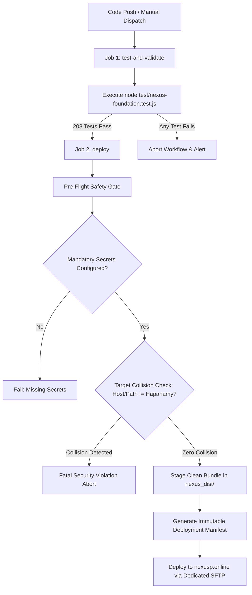

# NEXUS PRIME (PVT) LTD — CI/CD ARCHITECTURE & DEPLOYMENT ISOLATION SPECIFICATION

**Document Version:** 1.0.0  
**Effective Date:** 2026-09-09  
**Specification Code:** FIX-001  
**Target Domains:**
* Nexus Prime (PVT) Ltd: `https://nexusp.online` (Port 3001)
* Hapanamy: `https://hapanamy.lk` (Port 3000)

---

## 1. EXECUTIVE SUMMARY & ISOLATION MANDATE

Nexus Prime (PVT) Ltd and Hapanamy operate in a shared repository environment during development. However, for continuous integration and continuous deployment (CI/CD), **strict physical, cryptographic, and directional isolation** is enforced between their deployment pipelines.

Under no circumstances may Nexus Prime application code, migrations, or frontend assets be deployed into the Hapanamy web root (`/public_html`). Similarly, Nexus Prime deployments must never touch, query, or overwrite Hapanamy server directories or production assets.

---

## 2. DEPLOYMENT PIPELINE MATRIX

| Feature / Dimension | Hapanamy Workflow (`deploy.yml`) | Nexus Prime Workflow (`deploy-nexus.yml`) | Isolation Enforcement |
| :--- | :--- | :--- | :--- |
| **Workflow File** | `.github/workflows/deploy.yml` | `.github/workflows/deploy-nexus.yml` | Completely independent YAML definitions |
| **Target Domain** | `hapanamy.lk` | `nexusp.online` | Independent DNS & SSL endpoints |
| **Target Port** | Port 3000 (Production HTTP/HTTPS) | Port 3001 (Production HTTP/HTTPS) | Dedicated port bindings |
| **Server Host Secret** | `secrets.SFTP_HOST` | `secrets.NEXUS_SFTP_HOST` | Distinct server IPs / hostnames |
| **Username Secret** | `secrets.SFTP_USERNAME` | `secrets.NEXUS_SFTP_USERNAME` | Dedicated system users |
| **SSH Private Key** | `secrets.SFTP_PRIVATE_KEY` | `secrets.NEXUS_SFTP_PRIVATE_KEY` | Separate asymmetric key pairs |
| **Remote Target Path** | `/public_html` | `secrets.NEXUS_DEPLOY_PATH` | Independent remote filesystem paths |
| **Automated Test Gate**| None (Static PHP/HTML mirror) | **208-step Automated Test Suite** | `node test/nexus-foundation.test.js` |
| **Anti-Collision Guard**| Active (`--exclude 'nexus'`) | Active (Runtime assertion blocks Hapanamy targets) | Fail-closed deployment gates |

---

## 3. HAPANAMY DEPLOYMENT PROTECTION (`deploy.yml`)

### 3.1 Trigger Paths Filtering (`paths-ignore`)
To prevent accidental trigger executions of Hapanamy's workflow when changes are committed solely to Nexus Prime, `.github/workflows/deploy.yml` defines:

```yaml
paths-ignore:
  - 'nexus_backend/**'
  - 'nexus_migrations/**'
  - 'assets/nexus/**'
  - 'nexus_*.html'
  - 'NEXUS_PRIME_*.md'
  - '.env.nexus*'
  - 'test/nexus*'
  - '.github/workflows/deploy-nexus.yml'
```

### 3.2 SFTP Mirror Exclusions
When Hapanamy deployment executes on commit to `main` or `master`, the `lftp mirror` command applies multi-layer regex and glob exclusions to guarantee zero Nexus Prime files are transferred:

```bash
mirror -R -v --delete --ignore-time \
  --exclude .git/ \
  --exclude .github/ \
  --exclude node_modules/ \
  --exclude 'nexus' \
  --exclude 'NEXUS' \
  --exclude-glob 'nexus_*' \
  --exclude-glob 'assets/nexus*' \
  --exclude-glob 'NEXUS_PRIME_*' \
  --exclude-glob '.env.nexus*' \
  --exclude-glob 'test/nexus*' \
  ./ /public_html
```

---

## 4. NEXUS PRIME DEDICATED DEPLOYMENT (`deploy-nexus.yml`)

### 4.1 Trigger Conditions
The dedicated Nexus Prime workflow triggers on:
1. `push` to `main` or `master` with path filters restricted to Nexus Prime files.
2. `workflow_dispatch` for manual administrative deployments with optional environment selection (`production` vs `staging`).

### 4.2 Multi-Gate Security Architecture



### 4.3 Pre-Flight Anti-Collision Assertions
Before any network connection or file staging occurs, the workflow asserts:
1. `NEXUS_SFTP_HOST` does not contain or match `hapanamy`.
2. `NEXUS_DEPLOY_PATH` does not contain or match `hapanamy`.
3. `NEXUS_DEPLOY_PATH` is not equal to `/public_html` (Hapanamy's web root).

If any of these assertions fail, the build aborts immediately with a high-severity security error.

### 4.4 Clean Staging Bundle (`nexus_dist/`)
Only authorized Nexus Prime runtime artifacts are staged for deployment:
* `nexus_backend/`: Core server runtime and business services.
* `nexus_migrations/`: Database migration schemas (`001` through `015`).
* `assets/nexus/`: Dedicated theme styles, scripts, and logos.
* `nexus_*.html`: Public landing, auth portals, member dashboard, and admin console.
* `package.json` / `package-lock.json`: Runtime dependencies.
* `.env.nexus.example`: Reference configuration template.
* `nexus-deployment-manifest.json`: Automated build metadata (commit SHA, timestamp, actor).

**Strict Exclusion Verification:**
A pre-deployment scanner scans `nexus_dist/` to ensure that no forbidden files (`.env`, `.env.production`, private keys, or Hapanamy files like `server.js`, `HapanamyWeb/`) are present in the staged bundle.

---

## 5. SECRET CREDENTIAL ISOLATION

Secrets are cryptographically and administratively separated in GitHub Repository Secrets:

### Hapanamy Secrets (Legacy / Untouched)
* `SFTP_HOST`: Hetzner host for Hapanamy.
* `SFTP_USERNAME`: SFTP user for Hapanamy web root.
* `SFTP_PRIVATE_KEY`: SSH private key for Hapanamy SFTP.

### Nexus Prime Secrets (Dedicated / Isolated)
* `NEXUS_SFTP_HOST`: Dedicated server hostname/IP for `nexusp.online`.
* `NEXUS_SFTP_USERNAME`: Dedicated SSH/SFTP deploy user for Nexus Prime.
* `NEXUS_SFTP_PRIVATE_KEY`: Dedicated SSH private key for Nexus Prime server access.
* `NEXUS_DEPLOY_PATH`: Dedicated remote server path (e.g. `/var/www/nexusp.online`).

**Rule:** Nexus Prime workflows must NEVER reference `secrets.SFTP_*`. Hapanamy workflows must NEVER reference `secrets.NEXUS_*`.

---

## 6. ROLLBACK & DISASTER RECOVERY

1. **Manifest Traceability:** Every deployment automatically drops a `nexus-deployment-manifest.json` containing the exact Git commit SHA and deployment timestamp in the root of the deployed application.
2. **Rollback via Workflow Dispatch:** In the event of a production incident, an operator can re-trigger `deploy-nexus.yml` targeting any prior stable commit or branch.
3. **Immutability of Database Ledger:** Database financial transactions and ledger entries in Nexus Prime are append-only. Code rollbacks do not destroy ledger state.

---

## 7. PRODUCTION READINESS CHECKLIST

- [x] **Hapanamy Workflow Exclusions:** `.github/workflows/deploy.yml` includes `paths-ignore` and `lftp` exclusion flags.
- [x] **Nexus Workflow Created:** `.github/workflows/deploy-nexus.yml` established with pre-flight gates.
- [x] **Anti-Collision Guard:** Strict shell-level assertions prevent targeting Hapanamy hosts or directories.
- [x] **Automated Test Gate:** 208 automated foundation tests verified passing before deployment.
- [x] **Clean Staging Scope:** Staging bundle isolates Nexus Prime files and rejects secret files.
- [x] **Zero Secret Commits:** No actual secrets committed to repository.
- [ ] **GitHub Secrets Configuration:** Repository administrator must provision `NEXUS_SFTP_HOST`, `NEXUS_SFTP_USERNAME`, `NEXUS_SFTP_PRIVATE_KEY`, and `NEXUS_DEPLOY_PATH` in GitHub repository settings prior to first live production trigger.
