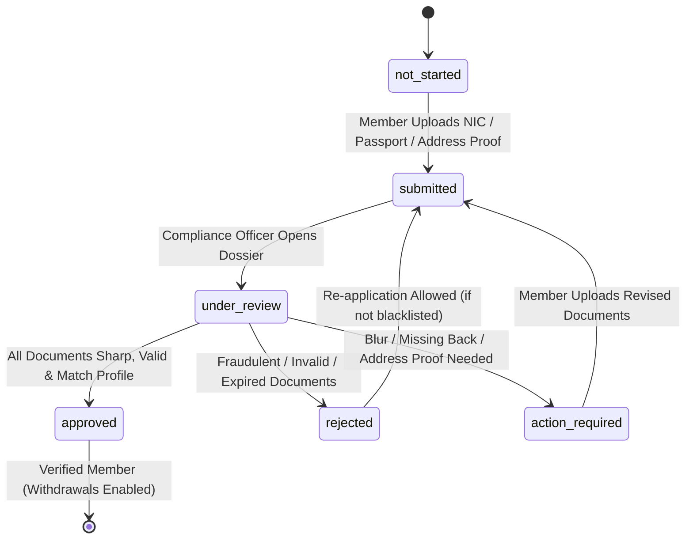

# Nexus Prime (PVT) Ltd — KYC / Member Verification & Compliance System
**System Code:** NP-SYS-KYC-018  
**Document Version:** 1.0.0  
**Environment:** Production-Isolated (`https://nexusp.online`)  
**Applicable Scope:** Prompt 18  

---

## 1. Executive Compliance Architecture
The **Nexus Prime KYC & Member Verification System** enforces strict anti-money laundering (AML), counter-terrorist financing (CTF), and financial compliance checks across all distributor accounts before financial withdrawals can occur.

```
Member Registration
        ↓
Account Created
        ↓
KYC Dossier Submission (NP-KYC-XXXXXX)
        ↓
Compliance Review (under_review)
        ↓
Approved & Verified Member (verification_status = 'verified')
        ↓
Financial Features Unlocked
        ↓
Withdrawal / Bank Payout Allowed
```



---

## 2. Core Security & Privacy Guarantees

1. **Sequential Human-Readable Numbering**:
   - Submissions receive sequential IDs: `NP-KYC-000001`, `NP-KYC-000002`, etc.

2. **Data Minimization & Number Masking**:
   - Identity document numbers (NIC, Passport, Driving License) are stored and rendered strictly masked: `******1234`.
   - Raw identity numbers are never returned in plain text in public or member APIs.

3. **Private Document Storage with HMAC-SHA256 Signed URLs**:
   - Document files are stored in private isolated storage (`kyc-storage/{userId}/{guid}.enc`).
   - Zero public S3/web buckets.
   - Access requires a short-lived (15-minute) HMAC-SHA256 signed access token (`docId.expiresAt.sig`).
   - IDOR guards strictly ensure members can ONLY generate access tokens for their own documents, while authorized compliance admins can inspect queue documents.

4. **Mandatory Withdrawal Compliance Gate**:
   - If `kyc_required_for_withdrawal` is enabled (default `true`), `nexusWithdrawalService.requestWithdrawal` blocks any unverified or pending member with error code `KYC_REQUIRED`.
   - Protects corporate funds from unauthorized or unverified bank payouts.

5. **Immutable Audit Trail (`nexus_kyc_review_events`)**:
   - Every status transition (`submitted`, `started_review`, `approved`, `rejected`, `requested_changes`) is permanently and immutably recorded with actor ID, timestamp, and clear notes.

---

## 3. Database Schema Reference

- **`nexus_kyc_requirements`**:
  - Defines verification level rules (`basic`, `enhanced`) and required document types (`national_id`, `passport`, `driving_license`, `utility_bill`, `bank_statement`).
- **`nexus_kyc_submissions`**:
  - `id`, `submission_number`, `member_id`, `verification_level`, `status`, `legal_name`, `date_of_birth`, `country`, `residential_address`, `submitted_at`, `reviewed_at`, `reviewed_by`, `decision_reason`, `rejection_reason`, `action_required_reason`.
- **`nexus_kyc_documents`**:
  - `id`, `member_id`, `submission_id`, `document_type`, `document_side`, `document_number_masked`, `masked_number`, `storage_path`, `file_name`, `mime_type`, `file_size_bytes`, `document_status`.
- **`nexus_kyc_review_events`**:
  - `id`, `submission_id`, `member_id`, `previous_status`, `new_status`, `action`, `reviewer_id`, `reason`, `created_at`.
- **`nexus_kyc_document_access_logs`**:
  - `id`, `document_id`, `member_id`, `accessor_id`, `accessor_role`, `action`, `created_at`.

---

## 4. Endpoints Specification

| Method | Endpoint | Authorization | Description |
| :--- | :--- | :--- | :--- |
| `GET` | `/api/v1/nexus/member/kyc/status` | Member Bearer | Member KYC standing, checklist, and active submission |
| `POST` | `/api/v1/nexus/member/kyc/submit` | Member Bearer | Submit identity documents for compliance verification |
| `GET` | `/api/v1/nexus/member/kyc/documents/:id/token` | Member Bearer | Generate signed access token for own uploaded document |
| `GET` | `/api/v1/nexus/kyc/documents/stream` | Token Query Param | Authenticated streaming of private document image/PDF |
| `GET` | `/api/v1/nexus/admin/kyc/stats` | Admin Bearer | Compliance queue KPIs (pending, under review, verified) |
| `GET` | `/api/v1/nexus/admin/kyc/submissions` | Admin Bearer | Filterable review queue across entire network |
| `GET` | `/api/v1/nexus/admin/kyc/submissions/:id` | Admin Bearer | Open complete member KYC dossier with doc previews |
| `POST` | `/api/v1/nexus/admin/kyc/submissions/:id/start-review` | Admin Bearer | Lock dossier and transition status to `under_review` |
| `POST` | `/api/v1/nexus/admin/kyc/submissions/:id/approve` | Admin Bearer | Approve dossier, verify member, and unlock payouts |
| `POST` | `/api/v1/nexus/admin/kyc/submissions/:id/reject` | Admin Bearer | Reject dossier with formal reason |
| `POST` | `/api/v1/nexus/admin/kyc/submissions/:id/request-changes`| Admin Bearer | Request updated documents from member |
| `GET` | `/api/v1/nexus/admin/kyc/documents/:id/token` | Admin Bearer | Generate secure signed access URL for compliance inspection |
