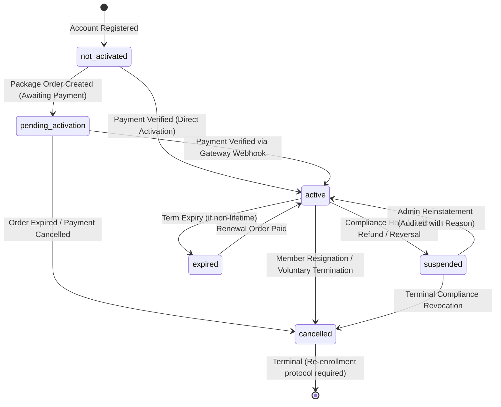

# Nexus Prime (PVT) Ltd — Membership Activation & Status Engine
**System Code:** NP-SYS-MEM-019  
**Document Version:** 1.0.0  
**Environment:** Production-Isolated (`https://nexusp.online`)  
**Applicable Scope:** Prompt 19  

---

## 1. Executive Summary & Purpose

The **Nexus Prime Membership Activation & Status Engine** provides a centralized, secure, server-side authoritative business rules layer governing distributor lifecycle standing.

Before Prompt 19, multiple subsystems (MLM, Commissions, Withdrawals, Rank) independently attempted to evaluate whether a user was "active" or "eligible". This engine eliminates ambiguity by establishing an authoritative state machine, strict idempotency controls, and decoupled standing models.

```
       ┌─────────────────────────────────────────────────────────────┐
       │             Central Membership Lifecycle Engine             │
       └──────────────────────────────┬──────────────────────────────┘
                                      │
              ┌───────────────────────┼───────────────────────┐
              ▼                       ▼                       ▼
     Payment Gateway            Admin Action          System Expiry / Refund
 (Verified Webhook / Tx)     (Audited Override)      (Non-Destructive State)
              │                       │                       │
              └───────────────────────┼───────────────────────┘
                                      │
                                      ▼
                      ┌───────────────────────────────┐
                      │    Authoritative Membership   │
                      │       nexus_memberships       │
                      └───────────────┬───────────────┘
                                      │
                                      ▼
                      ┌───────────────────────────────┐
                      │   Immutable Audit Trail       │
                      │   nexus_membership_history    │
                      └───────────────────────────────┘
```

---

## 2. Core Principle: Decoupled Status Separation

Nexus Prime strictly enforces the separation of independent platform dimensions. Subsystems must **never conflate or collapse** these into a single flag:

| Dimension | Managed In | Valid Values | Semantics |
| :--- | :--- | :--- | :--- |
| **Account Status** | `nexus_member_profiles.status` | `active`, `pending`, `suspended`, `blocked`, `inactive` | Member portal login, account existence, access to dashboard. |
| **Membership Status** | `nexus_memberships.status` | `not_activated`, `pending_activation`, `active`, `suspended`, `expired`, `cancelled` | Official distributor contract & commercial platform standing. |
| **KYC Verification** | `nexus_member_profiles.verification_status` | `not_started`, `submitted`, `under_review`, `action_required`, `verified`, `rejected` | Anti-money laundering & identity compliance standing. |
| **Payment Status** | `nexus_payments.status` | `pending`, `paid`, `failed`, `refunded` | Financial settlement state of an order transaction. |
| **Package Tier** | `nexus_memberships.package_code` | `NONE`, `NP-PKG-01`, `NP-PKG-02`, etc. | Entitlement tier associated with active membership. |

---

## 3. Membership State Machine Specification



### 3.1 Allowed State Machine Transitions

```javascript
const allowedTransitions = {
    'not_activated':      ['pending_activation', 'active'],
    'pending_activation': ['active', 'cancelled'],
    'active':             ['suspended', 'expired', 'cancelled'],
    'suspended':          ['active', 'cancelled'],
    'expired':            ['active', 'cancelled'],
    'cancelled':          [] // Terminal state
};
```

Any attempt to execute an unregistered transition (e.g., `cancelled -> active` without administrative re-enrollment, or `expired -> not_activated`) throws an authoritative exception: `Invalid transition from [fromStatus] to [toStatus]`.

---

## 4. Activation Rules Engine

Activations are governed by priority-ranked activation rules (`nexus_activation_rules`):

1. **RULE-ACT-001 (Account Must Be Active)**:
   - Account status must be `active`. Suspended or blocked accounts cannot be activated.
2. **RULE-ACT-002 (Order Payment Verified)**:
   - For order-driven activations, the order must exist, be in `paid` or `completed` status, and have a matching verified payment record.
3. **RULE-ACT-003 (Idempotency Protection)**:
   - Duplicate payment callbacks for an already-active membership are short-circuited safely without duplicate history logs or date overwrites.
4. **RULE-ACT-004 (Admin Audit Reason Requirement)**:
   - Manual activations by administrators strictly require a minimum 5-character reason and the admin's operator user ID.

---

## 5. Non-Destructive Refund & Reversal Handling

When an activation package order is refunded, reversed, or charged back:
1. `nexusMembershipService.handleRefundOrReversal(orderId, reason)` is triggered.
2. The active membership is transitioned to `suspended`.
3. An immutable record is created in `nexus_membership_history` with `source_type = 'refund'`.
4. The member profile and network hierarchy remain intact (zero tree distortion).
5. All future commission calculations and payouts are immediately gated.
