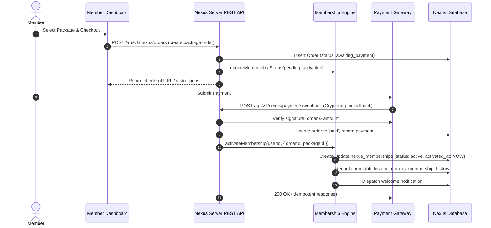

# Nexus Prime (PVT) Ltd — Membership Workflow & Operational Lifecycle
**System Code:** NP-SYS-WORKFLOW-019  
**Document Version:** 1.0.0  
**Environment:** Production-Isolated (`https://nexusp.online`)  
**Applicable Scope:** Prompt 19  

---

## 1. End-to-End Member Activation Workflow

---

## 2. Administrator Operational Workflow

Administrators interact with the centralized engine via `#admin-tab-eligibility` on `nexus_admin.html`:

1. **KPI Dashboard & Health Metrics**:
   - Live counters of active members, not activated, pending activation, and suspended.
   - Real-time KYC and payment blocker tracking.

2. **Multi-Filter Directory**:
   - Filter members simultaneously by:
     - Account Status (`active`, `suspended`, `blocked`)
     - Membership Status (`not_activated`, `active`, `suspended`, `cancelled`)
     - KYC Status (`not_started`, `submitted`, `verified`)
     - Financial Withdrawal Eligibility (`eligible`, `ineligible`)
     - MLM Eligibility (`eligible`, `ineligible`)

3. **Audited State Action Modal (`#adminMembershipModalBackdrop`)**:
   - Allows compliance officers to perform audited transitions:
     - `ACTIVATE`
     - `SUSPEND`
     - `REINSTATE`
     - `CANCEL`
   - **Mandatory Reason Enforcement**: Action cannot be dispatched without a minimum 5-character documented reason.
   - Operator ID, previous state, new state, and reason are permanently recorded in `nexus_membership_history`.

4. **Membership Reconciliation Scanner**:
   - Runs on-demand consistency diagnostics across 4 key invariants:
     - Rule 1: Paid package order but membership not active (`PAID_ORDER_MEMBERSHIP_INACTIVE`).
     - Rule 2: Active membership linked to refunded/cancelled order (`ACTIVE_MEMBERSHIP_REFUNDED_ORDER`).
     - Rule 3: Payout disbursed to unverified member (`PAYOUT_TO_UNVERIFIED_MEMBER`).
     - Rule 4: Suspended account with active membership (`SUSPENDED_ACCOUNT_ACTIVE_MEMBERSHIP`).
