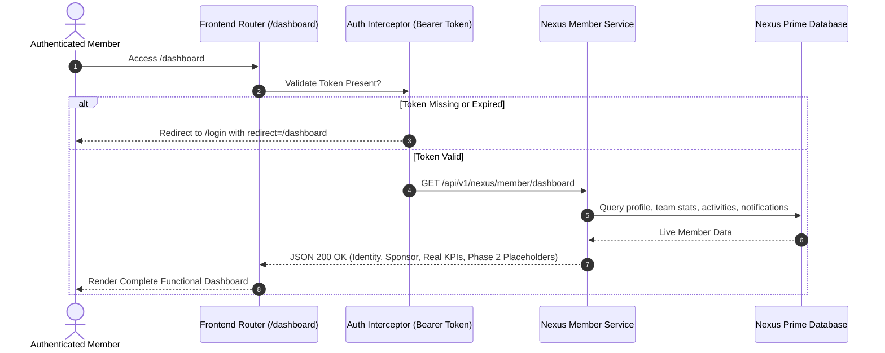
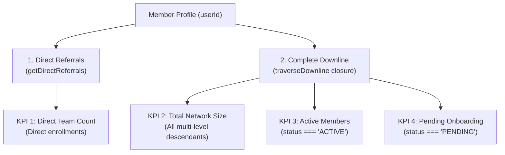

# NEXUS PRIME (PVT) LTD — FUNCTIONAL MEMBER DASHBOARD SPECIFICATION
**Domain:** `nexusp.online`  
**System Layer:** Member Application Frontend & Backend Services  
**Version:** 1.0.0-PROD  
**Status:** Live, Fully Implemented & Test-Verified  

---

## 1. Executive Summary & Safety Invariants

The **Nexus Prime Member Dashboard** (`/dashboard` & `nexus_dashboard.html`) serves as the central operational cockpit for authenticated network members of Nexus Prime (PVT) Ltd (`nexusp.online`).

### Core Safety Invariants:
1. **100% Hapanamy.lk Isolation**: Zero interaction with `hapanamy.lk`. No shared database tables, rows, authentication records, storage buckets, or environment variables. All operations are exclusively contained within the Nexus Prime isolated runtime.
2. **Strict Financial Safeguard**: Absolutely NO fake LKR, USD, or phantom wallet balances, earnings, or transactions are rendered. All financial widgets are marked with explicit neutral placeholders (`"Coming Soon — Available in Phase 2"`), and API payloads return `null` balances with `isAvailable: false`.
3. **Immutability of Network Invariants**: Critical member attributes—`member_id`, `referral_code`, `sponsor_id`, `status`, `rank`, `package_status`, and `registration_date`—cannot be modified by client requests. The backend enforces strict field immunity.
4. **Data Ownership & Isolation**: Members can only access their own profile, downline referrals, team directory, personal notifications, and activity stream. Cross-member access and unauthorized administrative elevation are strictly blocked.

---

## 2. Authentication, Routing & Dashboard Navigation Flow

### Route Structure:
- **Client Route:** `/dashboard` $\to$ Serves `nexus_dashboard.html`
- **API Base:** `/api/v1/nexus/member/*`
- **Session Lifespan:** Secure Bearer JWT token stored in client storage, verified on every API request.



---

## 3. Member Identity & Sponsor Attribution

### 3.1 Authenticated Member Identity
- **Member ID:** Standardized sequential identifier (e.g. `NP000001`, `NP000002`).
- **Account Status Badge:** Real-time visual status (`ACTIVE` [Green], `PENDING` [Amber], `SUSPENDED` [Red]).
- **Profile Avatar:** User initials fallback (e.g. `JS` for John Smith) or custom uploaded profile photo.
- **Registration Timestamp:** Formatted human-readable date (`e.g. 2026-09-09`).

### 3.2 Sponsor Card Attribution
- **Sponsored Member:** Displays Sponsor Name, Sponsor Member ID (`NPxxxxxx`), Sponsor Referral Code, and Direct Contact Phone.
- **Root / Independent Member Fallback:** For members without an upline sponsor (such as the Corporate Root `NP000001` or direct corporate enrollees):
  - Card Header: `Direct Corporate Member`
  - Name: `Nexus Prime Corporate`
  - Identifier: `NP000001` (or `Independent Account`)
  - Status Notice: `"Your account is registered directly under corporate sponsorship without an intermediary sponsor."`
  - **Zero Fake Data:** No placeholder or fictional sponsor names are generated.

---

## 4. Financial Safeguard Architecture & Phase 2 Policy

Per corporate requirements, payment gateways, live commission calculations, and withdrawal processing are strictly scheduled for Phase 2. To uphold absolute commercial and legal integrity:

| Field / UI Element | Policy | Implementation Detail |
| :--- | :--- | :--- |
| **Wallet Balance** | `null` | Returns `availableBalance: null`, UI shows `Coming Soon` badge |
| **Total Earnings** | `null` | Returns `totalEarnings: null`, UI shows `Phase 2 Module` |
| **Pending Payouts**| `null` | Card disabled with lock icon |
| **Recent Transactions**| Empty State | `"Financial ledger will activate upon Phase 2 launch"` |
| **Withdraw Button**| Disabled | Button displays tooltip: `"Withdrawals available in Phase 2"` |

```json
{
  "financials": {
    "isAvailable": false,
    "badge": "Coming Soon",
    "phase": "Phase 2",
    "availableBalance": null,
    "totalEarnings": null,
    "pendingPayout": null,
    "currency": "LKR",
    "note": "Financial transactions and wallet services will activate in Phase 2."
  }
}
```

---

## 5. Live Network Analytics & Downline Performance Metrics

The dashboard calculates real downline statistics dynamically from the member network closure store:



### Metrics Definition:
1. **Direct Team:** Total number of users whose `sponsor_id` matches the current member's `user_id`.
2. **Total Network:** Total recursive count of all downline members across all levels ($L_1 \dots L_n$).
3. **Active Team:** Count of downline members in good standing (`status === 'ACTIVE'`).
4. **Pending Team:** Count of downline members who have initiated registration but pending verification (`status === 'PENDING'`).

---

## 6. Member Profile Management (Personal vs. Account Separation)

The profile management interface strictly enforces separation of concerns:

### Section A: Personal Information (Editable)
- **Fields:** `Full Name`, `Display Name`, `Phone Number`, `Residential Address`, `Country / Region`, `Profile Avatar`.
- **Validation:** 
  - Phone format validation.
  - Length and character sanitization.
- **Endpoint:** `PUT /api/v1/nexus/member/profile`

### Section B: Account & MLM Standing (Immutable)
- **Fields:** `Member ID`, `Referral Code`, `Sponsor Name & ID`, `Current Rank`, `Package Status`, `Account Status`, `Registration Date`.
- **Enforcement:** The backend `NexusMemberService.updateProfile` utilizes a strict field allowlist (`fullName`, `displayName`, `phone`, `address`, `country`, `profileImageUrl`). Any attempted mutation of protected invariant fields is silently stripped, preserving database state integrity.

---

## 7. Profile Photo Upload Architecture

Members can upload profile photos with comprehensive security validation:

```mermaid
sequenceDiagram
    autonumber
    actor Member as Member Browser
    participant Client as nexus_dashboard.html
    participant API as POST /member/profile-image
    participant DB as nexus_member_profiles

    Member->>Client: Select image file (JPG/PNG/WebP)
    Client->>Client: Client check: File size <= 2MB
    Client->>Client: Read via FileReader (dataURL / base64)
    Client->>API: POST { imageBase64: "data:image/png;base64,..." }
    API->>API: Server MIME Validation: image/jpeg, image/png, image/webp
    API->>API: Server Byte Length Validation: <= 2 * 1024 * 1024 (2MB)
    API->>DB: Persist profile_image_url
    DB-->>API: Profile Updated
    API-->>Client: 200 OK { success: true, profileImageUrl }
    Client-->>Member: Render Avatar in Topbar, Hero & Profile Card
```

---

## 8. Direct Referrals Hub

### 8.1 Canonical Referral URL & Sharing
- **Canonical Format:** `https://nexusp.online/register?ref={REFERRAL_CODE}`
- **Copy to Clipboard:** One-click copy with toast notification (`"Referral link copied to clipboard!"`).
- **Social Sharing:** Instant share triggers for WhatsApp, Telegram, Facebook, and Email.

### 8.2 Paginated Direct Referrals Directory
- **Endpoint:** `GET /api/v1/nexus/member/referrals?page=1&limit=10&status=ALL&search=smith`
- **Features:**
  - Real-time text search (matches Full Name, Display Name, Member ID, or Email).
  - Status filter dropdown (`All`, `Active`, `Pending`, `Suspended`).
  - Column fields: Member ID, Full Name, Contact Email, Enrollment Date, Current Status, Network Rank.
  - Responsive pagination controls with page indicators and previous/next navigation.

---

## 9. Team Directory & Multi-Level Network Explorer

### 9.1 Downline Team Directory Table
- **Endpoint:** `GET /api/v1/nexus/member/team?page=1&limit=10&status=ALL&search=`
- **Features:**
  - Full visibility across all recursive downline levels ($L_1, L_2, L_3 \dots$).
  - **Relative Network Level Badge:** Dynamically calculated relative distance from the viewing member (`Level 1`, `Level 2`, etc.).
  - Direct Sponsor attribution for every downline node.
  - Search and status filtering.

### 9.2 Real-time Team Summary Cards
- Embedded 4-card KPI header providing instant totals for Direct Members, Total Downline, Active Distributors, and Pending Registrations.

---

## 10. Notification Center & Member Activity Stream

### 10.1 Notifications Subsystem
- **User-Specific Store:** Each member maintains their own isolated notification queue.
- **Topbar Bell Indicator:** Dynamic red notification badge displaying the exact count of unread alerts (`unreadCount`).
- **Notification Types:**
  - `WELCOME` $\to$ New account orientation.
  - `REFERRAL_JOINED` $\to$ Real-time notification when a new direct downline member registers with the member's code.
  - `SYSTEM_UPDATE` $\to$ Platform notices.
- **Operations:**
  - Mark single notification as read: `PUT /api/v1/nexus/member/notifications/read` (`{ notificationId }`).
  - Mark all as read: `PUT /api/v1/nexus/member/notifications/read` (`{ all: true }`).

### 10.2 Member Activity Feed vs. Administrative Audit Logs
- **Strict Separation:** Member Activity (`memberActivities`) displays clean, human-friendly milestones (e.g. `"New Direct Referral Joined"`, `"Profile Updated"`).
- **Administrative Audit Logs (`auditLogs`):** Retained separately for system administrators with technical metadata (client IP addresses, browser user agents, raw mutation diffs, and security events).

---

## 11. Security, Authorization & Access Controls

1. **Authentication Token Guard:** All member endpoints require `Authorization: Bearer <token>`. Requests with missing, expired, or tampered tokens return `401 Unauthorized`.
2. **Data Isolation:** User ID is extracted directly from the verified JWT payload (`req.user.id`). Members cannot supply a foreign `userId` to query or modify other members' data.
3. **Role Segregation:** Administrative endpoints (`/api/v1/nexus/admin/*`) require `ADMIN` or `SUPERADMIN` roles. Regular members attempting access receive `403 Forbidden`.
4. **Input Sanitization:** All profile text inputs and upload payloads are sanitized against XSS and injection attacks.

---

## 12. Automated Verification & Quality Assurance Matrix

The complete Nexus Prime platform is verified by an automated test suite featuring **32 comprehensive test cases**:

| Test ID | Test Description | Subsystem | Status |
| :--- | :--- | :--- | :---: |
| **01** | Root Corporate Admin Seed Verification | Core DB | ✅ PASSED |
| **02** | Sequential Member ID Generation (`NP000002`...) | Identity | ✅ PASSED |
| **03** | Safe Unique Referral Code Generation (`NEXUS...`) | Referral Engine | ✅ PASSED |
| **04** | PBKDF2-SHA512 Password Hashing & Verification | Security | ✅ PASSED |
| **05** | Live Referral Code Validation (Valid, Invalid, Empty) | Validation | ✅ PASSED |
| **06** | Suspended Sponsor Referral Attempt Rejection | Integrity | ✅ PASSED |
| **07** | Self-Referral Prevention | MLM Rules | ✅ PASSED |
| **08** | Member Registration under Sponsor | User Flow | ✅ PASSED |
| **09** | Duplicate Email Registration Rejection | User Flow | ✅ PASSED |
| **10** | Multi-Level Network Tree (Root $\to$ A $\to$ B $\to$ C $\to$ D) | Network Tree | ✅ PASSED |
| **11** | Network Closure & Multi-Level Traversal | Network Tree | ✅ PASSED |
| **12** | Dynamic Relative Level Distance Calculation | Network Tree | ✅ PASSED |
| **13** | Direct Referral Count vs Total Network Count | Analytics | ✅ PASSED |
| **14** | Circular Sponsor Prevention ($A \to B \to C \to A$) | Integrity | ✅ PASSED |
| **15** | Progressive Tree Loading Endpoint | Network API | ✅ PASSED |
| **16** | Inactive/Suspended Downline Visibility & Status Filtering | Visibility | ✅ PASSED |
| **17** | Nested Tree Hierarchy Generation for Visualizer | Visualizer | ✅ PASSED |
| **18** | Member Login & Token Issuance | Authentication | ✅ PASSED |
| **19** | Account Status Restriction Enforcement | Security | ✅ PASSED |
| **20** | Member Dashboard Foundation Data Aggregation | Dashboard API | ✅ PASSED |
| **21** | Profile Update & Protected Field Immunity | Profile | ✅ PASSED |
| **22** | Session Logout & Token Revocation | Authentication | ✅ PASSED |
| **23** | Clean URL Routing & Static Shell Resolution | Server Routing | ✅ PASSED |
| **24** | Admin Statistics & Role Guard Verification | Admin Guard | ✅ PASSED |
| **25** | **Member Dashboard Data & Neutral Financial Safeguard** | Dashboard | ✅ PASSED |
| **26** | **Profile Personal vs Account Separation & Field Immunity** | Profile Security | ✅ PASSED |
| **27** | **Profile Photo Upload Validation (MIME & 2MB Limit)** | Storage | ✅ PASSED |
| **28** | **Direct Referrals Pagination, Search & Status Filtering** | Referral Hub | ✅ PASSED |
| **29** | **Downline Team Directory Pagination, Search & Stats** | Team Directory | ✅ PASSED |
| **30** | **Member Activity Logging & User-Facing Feed** | Activity Subsystem | ✅ PASSED |
| **31** | **Member Notifications System (Unread Count & Mark Read)**| Notifications | ✅ PASSED |
| **32** | **Cross-Member Isolation & Administrative Role Guard** | Auth Security | ✅ PASSED |

**All 32 tests pass synchronously with 0 failures.**
