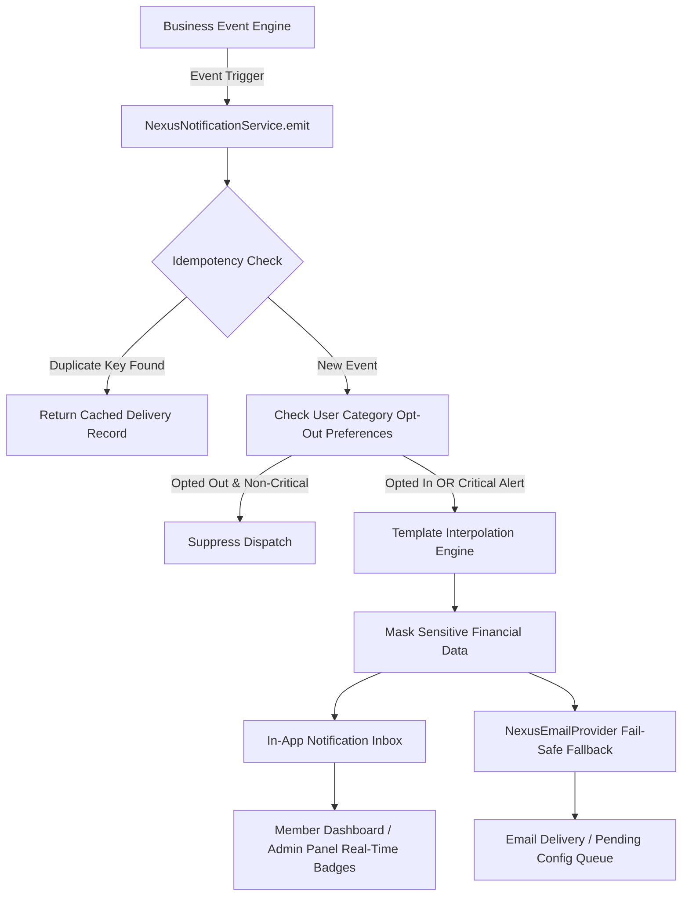

# Nexus Prime (PVT) Ltd — Notification & Communication System Architecture
**System Code:** NP-SYS-NOTIF-016  
**Document Version:** 1.0.0  
**Environment:** Production-Isolated (`https://nexusp.online`)  
**Applicable Scope:** Prompt 16  

---

## 1. Executive Architecture Overview
The **Nexus Prime Notification & Communication System** provides multi-channel, tamper-evident transactional and operational messaging across the entire distributor network and administrative staff.

---

## 2. Core Security & Compliance Guarantees

1. **Deterministic Idempotency Protection**:
   - Every system notification requires or automatically hashes an `idempotency_key` (`eventType:refType:refId:recipientId`).
   - Prevents duplicate alerts during browser refreshes, payment webhooks, or retry loops.

2. **Sensitive Financial Data Sanitization**:
   - Bank account numbers, wire references, and payment instrument IDs are strictly masked before storage or rendering (`****1234`).
   - Raw credential or OTP tokens are never written into notification message bodies.

3. **Mandatory Critical Bypass**:
   - Member notification preferences allow muting marketing or general announcement categories.
   - Critical security alerts (`password_changed`, `new_login`) and legal/compliance notices (`kyc_verified`, `kyc_rejected`, `payout_sent`) bypass opt-out flags and are always delivered.

4. **Multi-Channel Provider Decoupling**:
   - `NexusEmailProvider` supports dynamic SMTP configurations while defaulting to a non-blocking `pending_configuration` mode that safely audits outgoing messages without crashing or delaying transactions.

---

## 3. Database Schema Reference

- **`nexus_notifications`**:
  - `id`: Unique identifier (`notif-xxxx`)
  - `recipient_id`: Target member or admin user UUID
  - `category`: `account`, `security`, `kyc`, `order`, `payment`, `commission`, `withdrawal`, `rank`, `announcement`
  - `priority`: `low`, `normal`, `high`, `critical`
  - `title`: Sanitized subject line
  - `message`: Interpolated body text
  - `action_url`: Deep-link into dashboard or admin tab
  - `reference_type`: Entity model name (`order`, `ticket`, `kyc`, `withdrawal`, `commission`)
  - `reference_id`: Entity UUID
  - `idempotency_key`: Unique deduplication hash
  - `is_read`: Boolean read status
  - `read_at`: ISO 8601 timestamp
  - `created_at`: Timestamp

- **`nexus_announcements`**:
  - Broadcast announcements targeting `all`, `verified_only`, `starter_tier`, `admin_only` with expiry boundaries.

- **`nexus_notification_preferences`**:
  - Member channel toggles (`in_app`, `email`, `sms`) and category flags (`marketing`, `orders`, `financial`).

- **`nexus_notification_delivery_logs`**:
  - Audit logs tracking dispatch status (`sent`, `delivered`, `pending_configuration`, `failed`) and masked destination addresses.

---

## 4. Endpoints Specification

| Method | Endpoint | Authorization | Description |
| :--- | :--- | :--- | :--- |
| `GET` | `/api/v1/nexus/member/notifications` | Member Bearer | List inbox notifications with unread counts |
| `GET` | `/api/v1/nexus/member/notifications/unread-count` | Member Bearer | Badge count for navbar bell icon |
| `PUT` | `/api/v1/nexus/member/notifications/:id/read` | Member Bearer | Mark single notification as read |
| `PUT` | `/api/v1/nexus/member/notifications/read` | Member Bearer | Bulk mark all notifications as read |
| `GET` | `/api/v1/nexus/member/notifications/preferences` | Member Bearer | Get notification preferences |
| `PUT` | `/api/v1/nexus/member/notifications/preferences` | Member Bearer | Update notification preferences |
| `GET` | `/api/v1/nexus/admin/announcements` | Admin Bearer | List corporate broadcast announcements |
| `POST` | `/api/v1/nexus/admin/announcements` | Admin Bearer | Dispatch new broadcast announcement |
| `GET` | `/api/v1/nexus/admin/notifications/outbox` | Admin Bearer | Inspect delivery logs & failure diagnostics |
