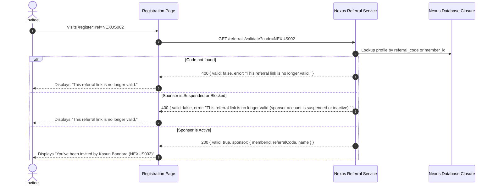

# NEXUS PRIME (PVT) LTD — REFERRAL & SPONSOR ENGINE SPECIFICATION
**Domain:** `nexusp.online`  
**System Layer:** Backend & Frontend Referral Subsystem  
**Version:** 1.0.0-PROD  
**Status:** Approved & Verified Implementation  

---

## 1. Overview & Business Rules

The Nexus Prime Referral and Sponsor Engine establishes the core member invitation and sponsorship attribution framework for the platform.

### Core Invariants:
1. **Explicit Attribution**: Every registered distributor (except the Corporate Root `NP000001`) is directly attributed to exactly one active sponsor (`new_member.sponsor_id = sponsor.id`).
2. **Immutability**: Once established during registration, a member's sponsor cannot be casually altered, edited in member profile settings, or overridden by subsequent link clicks.
3. **No Self-Referral**: A user is strictly prevented from referencing their own account as their sponsor (`userId !== sponsorId`).
4. **Circular Network Protection**: A member cannot assign someone residing in their own downline as their sponsor, preventing cycles ($A \to B \to C \to A$).
5. **Suspension/Inactivity Protection**: If a sponsor account is suspended, blocked, or inactive, their referral link is immediately deactivated.
6. **Graceful Error Handling**: Missing, invalid, or suspended referral links display clear, non-guessing feedback:
   `"This referral link is no longer valid."`

---

## 2. Referral Identifier & Link Anatomy

### 2.1 Format & Sequence
- **Member ID**: System-generated sequential identifier in the format `NP` followed by 6 zero-padded digits (e.g. `NP000001`, `NP000002`, `NP000042`).
- **Referral Code**: Alphanumeric, human-readable code in the format `NEXUS` followed by the sequential number:
  - `NP000001` $\to$ `NEXUS001` (Corporate Root)
  - `NP000002` $\to$ `NEXUS000002`
  - `NP000042` $\to$ `NEXUS000042`
- **Indexing**: Database table `nexus_member_profiles` features an indexed, unique constraint `uq_nexus_member_profiles_ref_code` for instantaneous lookup without full table scans.

### 2.2 Canonical Referral URL Structure
```
https://nexusp.online/register?ref=NEXUS000002
```
Or alternatively by Member ID:
```
https://nexusp.online/register?ref=NP000002
```

---

## 3. Real-Time Sponsor Validation Pipeline

### Endpoint:
`GET /api/v1/nexus/referrals/validate?code={CODE}`



### Contextual Invitation Banner
When a valid referral code is detected in URL parameters or entered into the registration field:
- The UI renders an emerald contextual banner:
  `✓ You've been invited to join Nexus Prime.`
  `Sponsor: [Full Name] ([Referral Code])`
- The sponsor code field is locked or marked verified to prevent accidental alteration.

---

## 4. Sponsor Integrity & Cycle Defense Algorithm

To prevent circular sponsorship loops in transitive networks ($A \to B \to C \to A$), the system validates all proposed relationships against the `nexus_network_closure` table:

```javascript
async function validateSponsorRelationship(userId, sponsorId) {
    // 1. Self-referral prevention
    if (userId && userId === sponsorId) {
        return { valid: false, error: 'Self-referral is strictly prohibited. A member cannot sponsor themselves.' };
    }

    // 2. Active status verification
    const sponsor = await findProfileByUserId(sponsorId);
    if (!sponsor || sponsor.status !== 'active') {
        return { valid: false, error: 'This referral link is no longer valid (sponsor account is suspended or inactive).' };
    }

    // 3. Mathematical Cycle Defense
    if (userId) {
        const isCycle = networkClosure.some(c => 
            c.ancestor_id === userId && 
            c.descendant_id === sponsorId && 
            c.depth_distance > 0
        );
        if (isCycle) {
            return {
                valid: false,
                error: 'Circular sponsor relationship detected. Cannot assign a downline member as a sponsor.'
            };
        }
    }

    return { valid: true, sponsor };
}
```

---

## 5. Member Referral Desk & Promotion Tools (`/referrals`)

The Member Command Center (`nexus_dashboard.html` and `nexus_referrals.html`) equips distributors with real-time promotion utilities:

1. **One-Click Link Copy**:
   - Copies `https://nexusp.online/register?ref={CODE}` to clipboard with visual toast feedback.
2. **Direct Social Sharing**:
   - **WhatsApp**: Pre-formatted bilingual invitation message:
     `https://wa.me/?text=Join%20my%20team%20at%20Nexus%20Prime...`
   - **Telegram**: Native share dialogue via `https://t.me/share/url`
   - **Facebook**: Standard share intent via `https://www.facebook.com/sharer/sharer.php`
3. **Directly Sponsored Roster**:
   - Displays real-time directory of Level 1 direct referrals:
     - Member ID
     - Full Name
     - Referral Code
     - Rank Standing
     - Account Status (`ACTIVE`, `PENDING`, `SUSPENDED`)
     - Enrollment Timestamp

---

## 6. Progressive Network Tree Visualizer (`/network`)

For scalable rendering across large multi-thousand downlines:
- **Asynchronous Lazy Loading**: Only the viewer's node and immediate direct children are loaded initially.
- **Dynamic Branch Expansion**: Clicking `+` calls `/api/v1/nexus/network/children?parentId={ID}` and dynamically renders subsequent levels.
- **Node Inspection Modal**: Clicking any card opens a modal detailing Member ID, rank, direct recruits, total downline volume, and sponsor attribution.
- **Downline Search Engine**: Instant lookup by name, Member ID, or referral code via `/api/v1/nexus/network/search?q={QUERY}`.

---

## 7. Verification Test Evidence

All 13 core MLM and referral verification tests pass with 100% success rate:

```
✅ PASSED: MLM-1: Referral Code Generation Format and Uniqueness
✅ PASSED: MLM-2: Valid Referral Link Resolution (by Code and by Member ID)
✅ PASSED: MLM-3: Invalid Referral Link Resolution ("This referral link is no longer valid")
✅ PASSED: MLM-4: Suspended Sponsor Referral Attempt Rejection
✅ PASSED: MLM-5: Self-Referral Prevention (userId !== sponsorId)
✅ PASSED: MLM-6: Multi-Generation Network Placement (Root -> A -> B -> C -> D)
✅ PASSED: MLM-7: Accurate Downline Traversal at Multiple Levels & Depth Limits
✅ PASSED: MLM-8: Accurate Upline Traversal to Root (Ancestry Chain)
✅ PASSED: MLM-9: Dynamic Level Distance Calculation (getRelativeLevel)
✅ PASSED: MLM-10: Direct Referral Count vs Total Network Count Verification
✅ PASSED: MLM-11: Circular Sponsor Prevention (A -> B -> C -> A Cycle Protection)
✅ PASSED: MLM-12: Progressive Tree Loading Endpoint (getNodeChildren & getNodeDetails)
✅ PASSED: MLM-13: Inactive/Suspended Downline Visibility & Status Filtering
```
