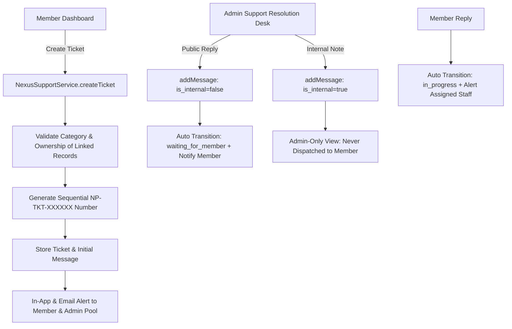

# Nexus Prime (PVT) Ltd — Support / Help Desk & Ticket Management System
**System Code:** NP-SYS-SUPP-017  
**Document Version:** 1.0.0  
**Environment:** Production-Isolated (`https://nexusp.online`)  
**Applicable Scope:** Prompt 17  

---

## 1. Executive Architecture Overview
The **Nexus Prime Support & Help Desk System** is designed for high-trust dispute resolution, ticket routing, and member inquiries while strictly preserving ledger and financial segregation.

---

## 2. Core Security & Compliance Guarantees

1. **Sequential Human-Readable Numbering**:
   - Tickets are stamped with atomic, sequential numbers: `NP-TKT-000001`, `NP-TKT-000002`, etc.

2. **Strict Internal Notes Isolation**:
   - Support staff can post internal investigation notes (`is_internal = true`).
   - The query layer strips internal messages entirely whenever the requesting user is a member (`!isAdmin`). No internal note text or presence leaks via API or UI.

3. **Safe Financial Linking**:
   - Members can link an order, payment, withdrawal, or commission record to their inquiry.
   - Ownership validation checks ensure members cannot link or discover records belonging to other distributors.

4. **Zero Balance Mutation Authority**:
   - Support staff and ticket controllers have zero permission to directly credit/debit member balances or bypass ledger controls.
   - Any financial adjustment must follow Prompt 08/09 double-entry ledger workflows with dedicated audit logs.

5. **Formula Injection Sanitization (CSV Export)**:
   - Exported ticket CSV records sanitize all user inputs against CSV command injection (`=`, `+`, `-`, `@` escaped with single quote `'`).

---

## 3. Database Schema Reference

- **`nexus_support_categories`**:
  - `account`, `kyc`, `package`, `order`, `payment`, `network`, `commission`, `withdrawal`, `technical`, `general`
- **`nexus_support_tickets`**:
  - `id`, `ticket_number`, `member_id`, `subject`, `category`, `priority` (`low`, `normal`, `high`, `urgent`), `status` (`open`, `in_progress`, `waiting_for_member`, `waiting_for_admin`, `resolved`, `closed`, `cancelled`), `assigned_admin_id`, `related_entity_type`, `related_entity_id`, `first_response_at`, `resolved_at`, `closed_at`
- **`nexus_support_ticket_messages`**:
  - `id`, `ticket_id`, `sender_type` (`member`, `admin`, `system`), `sender_member_id`, `sender_admin_id`, `message`, `is_internal`, `attachments`

---

## 4. Endpoints Specification

| Method | Endpoint | Authorization | Description |
| :--- | :--- | :--- | :--- |
| `GET` | `/api/v1/nexus/member/support/tickets` | Member Bearer | List member's tickets with status filtering |
| `POST` | `/api/v1/nexus/member/support/tickets` | Member Bearer | Create ticket with optional linked financial record |
| `GET` | `/api/v1/nexus/member/support/tickets/:id` | Member Bearer | View ticket conversation (internal notes excluded) |
| `POST` | `/api/v1/nexus/member/support/tickets/:id/messages` | Member Bearer | Post reply (auto-transitions to in_progress) |
| `PUT` | `/api/v1/nexus/member/support/tickets/:id/close` | Member Bearer | Self-close resolved ticket |
| `GET` | `/api/v1/nexus/admin/support/stats` | Admin Bearer | Support Desk KPIs (open, waiting, breach count) |
| `GET` | `/api/v1/nexus/admin/support/tickets` | Admin Bearer | Filterable resolution queue across entire platform |
| `GET` | `/api/v1/nexus/admin/support/tickets/:id` | Admin Bearer | View ticket with internal notes & member 360 context |
| `POST` | `/api/v1/nexus/admin/support/tickets/:id/messages` | Admin Bearer | Post public reply or private staff note |
| `PUT` | `/api/v1/nexus/admin/support/tickets/:id/assign` | Admin Bearer | Assign or transfer ticket to support specialist |
| `PUT` | `/api/v1/nexus/admin/support/tickets/:id/status` | Admin Bearer | Update ticket status (`in_progress`, `resolved`, etc.) |
| `GET` | `/api/v1/nexus/admin/support/tickets/export` | Admin Bearer | Download injection-safe sanitized CSV report |
