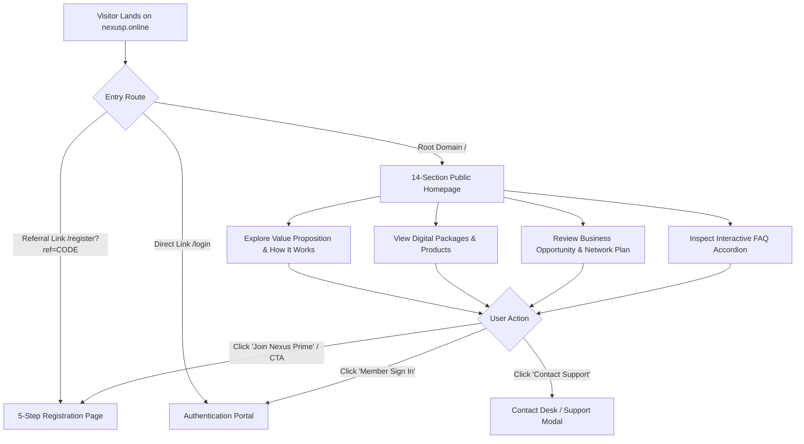
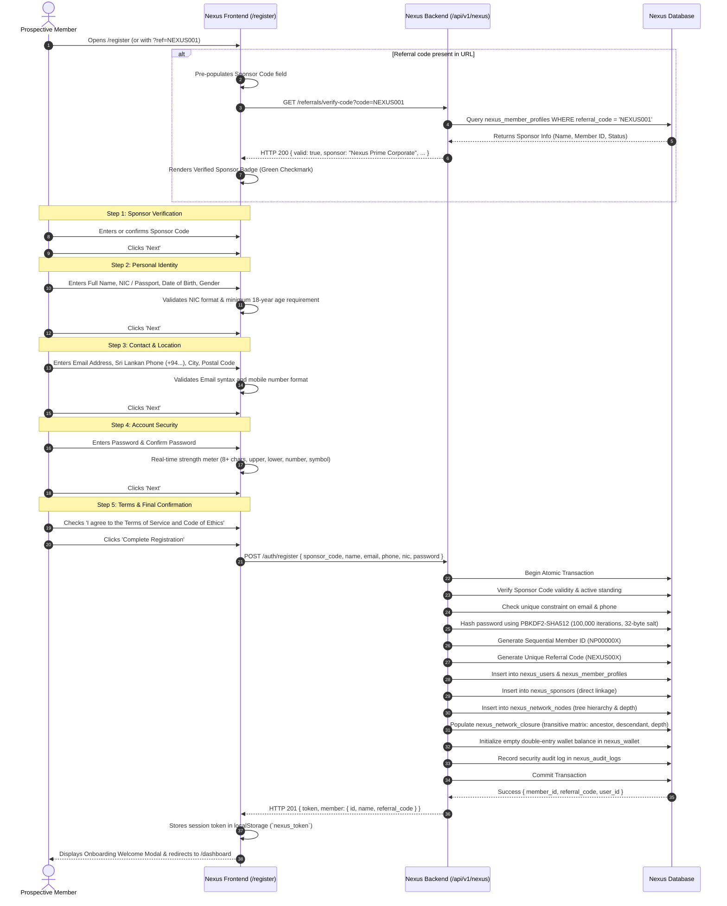
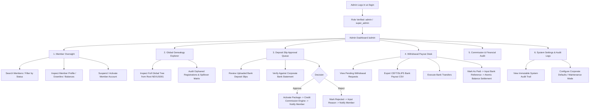

# NEXUS PRIME (PVT) LTD — SYSTEM USER FLOWS & INTERACTION BLUEPRINT
**Domain:** `nexusp.online`  
**Classification:** Product Architecture & User Journey Specification  
**Version:** 1.0.0-PROD  
**Status:** Approved Master Specification  

---

## 1. Architectural Flow Philosophy & Principles

Nexus Prime (PVT) Ltd operates an enterprise-grade digital e-commerce and multi-tier network distribution platform. The user flows are engineered around five non-negotiable architectural principles:

1. **Zero Confusion & Frictionless Progression:** Anonymous visitors encounter value propositions first, transparent earning mechanics second, and a seamless 5-step registration funnel third.
2. **Deterministic Sponsor Attribution:** Every member is placed strictly within the network tree via an immutable sponsor referral linkage. Direct referral links (`?ref=CODE`) auto-bind sponsors with live validation.
3. **Strict Role-Based Isolation:** Member capabilities and administrative oversight are physically separated into two distinct application contexts (`/dashboard` vs `/admin`), guarded by server-side verification and client-side guards.
4. **Asynchronous Financial Integrity:** Registration is intentionally decoupled from financial mutation. Commissions are never generated simply by account creation; they fire strictly upon verified product order settlements.
5. **Mobile-First Responsive Ergonomics:** Every user pathway (tree navigation, bank slip uploads, shareable link distribution) is designed for thumb-friendly interaction across mobile devices.

---

## 2. Flow 1: Public Website Visitor Flow



### Step-by-Step Experience:
1. **Landing & Immediate Identity:** Visitor lands on `https://nexusp.online/`. The header presents the Nexus Prime brandmark, high-contrast navigation links (About, How It Works, Opportunity, Packages, FAQ, Contact), and distinct action buttons: **Login** (Ghost cyan) and **Join Now** (Electric cyan filled).
2. **Hero Presentation:** High-impact banner with clear value proposition ("Unlocking Global Digital Commerce & Scalable Network Wealth"), key metrics (Active Distributors, Global Reach, Direct Training Bundles), and primary CTA.
3. **Exploration & Education:**
   - **Value Proposition:** The three pillars of Nexus Prime (Digital Skill Mastery, Direct Distribution, Ethical Network Scaling).
   - **How It Works:** Visual 3-stage progression: (1) Select Package, (2) Master High-Income Digital Skills, (3) Build Your Network & Earn Multi-Tier Commissions.
   - **Packages Preview:** Clean presentation of entry packages, curriculums, and distributor privileges.
   - **Network Model & Compensation:** Clear explanation of direct sales commissions, network leverage, and transparent daily caps.
   - **FAQ Accordion:** Instant answers to the 8 most critical prospect questions.
4. **Conversion Point:** Prominent recurring CTAs lead the visitor directly to the 5-Step Registration funnel (`/register`).

---

## 3. Flow 2: 5-Step Progressive Registration Journey



---

## 4. Flow 3: Secure Member & Admin Authentication Flow

```mermaid
flowchart TD
    A[User Navigates to /login] --> B[Enter Email / Member ID & Password]
    B --> C[Submit Form]
    C --> D{Frontend Validation}
    D -->|Invalid Format| E[Show Inline Validation Error]
    D -->|Valid| F[POST /api/v1/nexus/auth/login]
    
    F --> G{IP Rate Limiter Check}
    G -->|Rate Limit Exceeded| H[HTTP 429: Too Many Requests. Cooldown 15m]
    G -->|Permitted| I[Lookup User in nexus_users]
    
    I --> J{User Found & Active?}
    J -->|No| K[HTTP 401: Invalid credentials]
    J -->|Suspended / Blocked| L[HTTP 403: Account suspended. Contact corporate support]
    J -->|Yes| M[Verify PBKDF2-SHA512 Hash with Stored Salt]
    
    M -->|Hash Mismatch| K
    M -->|Hash Match| N{2FA Enabled?}
    
    N -->|Yes| O[Return HTTP 200 { mfa_required: true, temp_token }]
    O --> P[Prompt User for 6-Digit TOTP Code]
    P --> Q[Verify TOTP Token]
    Q -->|Invalid| P
    Q -->|Valid| R[Generate Signed Session JWT Token]
    
    N -->|No| R
    
    R --> S[Record Login in nexus_audit_logs]
    S --> T[Return Token & User Role Metadata]
    T --> U{User Role}
    
    U -->|member| V[Save Token in localStorage -> Redirect to /dashboard]
    U -->|admin / super_admin| W[Save Token in localStorage -> Redirect to /admin]
```

---

## 5. Flow 4: Member Protected Application Flow

Once logged into the Member Portal (`/dashboard`), the member navigates a clean, modular single-shell interface with high-performance responsive tabs:

```
                                  MEMBER APP SHELL
┌──────────────────────────────────────────────────────────────────────────────────┐
│  [NP] NEXUS PRIME        [Search Member...]             (Notifications) (Profile)│
├───────────────────┬──────────────────────────────────────────────────────────────┤
│  NAVIGATION       │  MAIN CONTENT VIEWPORT                                       │
│  - Dashboard      │  ┌─────────────────────────────────────────────────────────┐ │
│  - Profile        │  │ Welcome Back, Chinthaka! (ID: NP000002)                 │ │
│  - Referrals      │  │ Sponsor: Nexus Prime Corporate (NEXUS001)               │ │
│  - Network Tree   │  ├─────────────┬─────────────┬─────────────┬───────────────┤ │
│  - Team Directory │  │ Balance     │ Directs     │ Team Size   │ Total Earned  │ │
│  - Wallet         │  │ 45,000 LKR  │ 12 Active   │ 84 Members  │ 128,500 LKR   │ │
│  - Transactions   │  └─────────────┴─────────────┴─────────────┴───────────────┤ │
│  - Commissions    │                                                            │ │
│  - Withdrawals    │  [Share Your Referral Link: nexusp.online/register?ref=...]│ │
│  - My Packages    │  [Copy Link]  [WhatsApp Share]  [Telegram Share]           │ │
│  - Order History  │                                                            │ │
│  - Notifications  │  [Recent Team Activity Table]                              │ │
│  - Support        │                                                            │ │
│  - Settings       │                                                            │ │
│  - Logout         │                                                            │ │
└───────────────────┴──────────────────────────────────────────────────────────────┘
```

### Detailed Sub-Journeys for Members:

#### Journey 4A: Referral Link Sharing
1. Member clicks **My Referrals** (`/referrals`) in navigation.
2. System displays Member's unique Referral Code (`NEXUS002`) and pre-generated URL:  
   `https://nexusp.online/register?ref=NEXUS002`.
3. Member clicks **Copy Link** (triggers clipboard copy + toast feedback: *"Referral link copied!"*).
4. Direct one-click share buttons dispatch deep-links to WhatsApp, Telegram, or Email with pre-filled promotional invitation copy.
5. Below the link generator, the **Direct Referrals Directory** lists all personally sponsored distributors with registration date, package level, and active status.

#### Journey 4B: MLM Network Tree Visualizer
1. Member clicks **Network Tree** (`/network`).
2. Interface queries `GET /api/v1/nexus/network/tree` and renders a zoomable/panable genealogy visualizer.
3. Member appears as the root node; direct child nodes expand below.
4. Clicking any downline node triggers a slide-out drawer showing:
   - Distributor Name & Member ID
   - Placement Date & Depth Level
   - Personal Directs Count
   - Cumulative Team Size
5. Member uses the search box to search any downline distributor by Member ID or Name; the tree automatically pans and focuses on that node.

#### Journey 4C: Wallet & Withdrawal Request Journey
1. Member navigates to **Withdrawals** (`/withdrawals`).
2. System loads available balance from `GET /api/v1/nexus/member/dashboard`.
3. Member reviews minimum withdrawal threshold (1,000.00 LKR) and weekly settlement cutoff.
4. Member selects their registered Sri Lankan Bank Account (Commercial Bank, Sampath Bank, Bank of Ceylon, Hatton National Bank, etc.) or clicks *Add New Bank Account*.
5. Member enters withdrawal amount (e.g. 15,000 LKR) and optional note.
6. Validation checks:
   - Amount $\ge 1,000.00$ LKR?
   - Amount $\le$ Available Balance?
   - KYC Verification status = `APPROVED`?
7. Member clicks **Submit Withdrawal Request**.
8. Server processes transaction:
   - Decrements Available Balance in `nexus_wallet`.
   - Increments Pending Withdrawal Balance.
   - Creates a pending record in `nexus_withdrawals` with status `PENDING`.
   - Appends double-entry audit record in `nexus_wallet_transactions`.
9. Instant notification generated; status displays in Member's Withdrawal History table.

---

## 6. Flow 5: Administrator Command Center Flow

Administrators access `/admin` to exercise operational oversight, verify financial transactions, inspect the global network tree, and process payouts:



---

## 7. Flow 6: Exception & Edge-Case Handling

| Exception Scenario | Detection Point | System Response & UI Handling | Recovery Pathway |
|---|---|---|---|
| **Invalid or Inactive Sponsor Code** | `/register` Step 1 validation | Input border turns red; displays *"Sponsor code not recognized or account is inactive."* Disables 'Next' button. | User corrects code or clicks *"Join without sponsor"* (assigns to Root Corporate Sponsor `NEXUS001`). |
| **Duplicate Email or Phone** | `/register` Submission | Backend rejects with HTTP 409 Conflict: `{"error": "Email or mobile number is already registered."}`. | Wizard returns to Step 3, highlights duplicate field, provides link to `/login` or `/forgot-password`. |
| **Insufficient Withdrawal Balance** | `/withdrawals` Form Submission | Real-time client check + backend transaction lock fails if `amount > available_balance`. | Displays alert: *"Requested amount exceeds your available balance of Rs. XX,XXX.XX"*. |
| **Unverified KYC on Withdrawal** | `/withdrawals` Page Mount | Withdrawal form is locked; displays warning banner: *"Bank withdrawals require an approved National Identity Card (NIC)."* | Button redirects member directly to `/profile` KYC upload tab. |
| **Tampered / Stale Session Token** | Any Protected Route | Auth interceptor catches HTTP 401/403 or expired JWT signature. | Purges `localStorage.removeItem('nexus_token')`, saves current path in `?redirect=...`, redirects to `/login`. |
| **Direct Admin Access by Member** | Navigation to `/admin/*` | Role verification interceptor detects role `member`. | Halts render; logs unauthorized access attempt in `nexus_audit_logs`; immediately redirects user to `/dashboard`. |
| **Network Node Cycle / Collision** | Sponsor Placement Engine | Transitive closure checks `NOT EXISTS (SELECT 1 FROM nexus_network_closure WHERE ancestor_id = NEW.descendant_id AND descendant_id = NEW.ancestor_id)`. | Transaction aborted; error logged; administrator alerted. |

---

## 8. State Machine: Multi-Tier Entity Statuses

### A. Member Account Lifecycle
```
[ REGISTERED ] ──> [ ACTIVE ] ──> [ SUSPENDED ] ──> [ TERMINATED ]
                         │                │
                         └──> [ BLOCKED ] <┘
```

### B. Bank Deposit Slip / Order Lifecycle
```
[ PENDING_VERIFICATION ] ──┬──> [ APPROVED / COMPLETED ] ──> (Triggers Commission Allocation)
                           └──> [ REJECTED ] ──────────────> (Requires Resubmission)
```

### C. Withdrawal Request Lifecycle
```
[ SUBMITTED ] ──> [ UNDER_REVIEW ] ──┬──> [ PAID / COMPLETED ] (Balance Settled)
                                     └──> [ REJECTED ]        (Balance Refunded to Wallet)
```

---

*Document compiled and verified for Nexus Prime (PVT) Ltd (`nexusp.online`). All routes and flows correspond directly to the technical models established in `NEXUS_PRIME_SITEMAP.md` and `NEXUS_PRIME_ARCHITECTURE.md`.*
